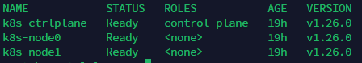
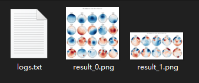
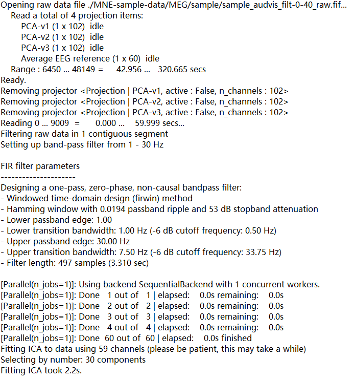
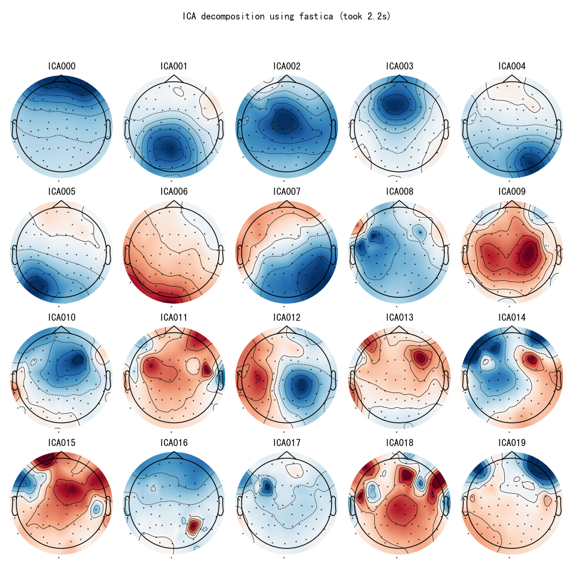

#  在线脑电分析平台开题预实验（以ICA算法可视化模块为例）

##  实验环境

###  软硬件环境

CPU: Intel Xeon E5-2676v3 with 12 Cores and 24 Threads

RAM: 64G DDR3 RECC

ROM: 1T SSD

Virtualization: Proxmox Virtual Environment 7.3-3

###  Kubernetes服务拓扑

本预实验搭建了3节点的Kubernetes集群（Kubernetes版本为v1.26.0）及单节点NFS服务器用于保存用户数据，集群内部使用flannel实现Pod间通信，通过执行kubectl get nodes查看集群节点信息如下所示：



详细信息表如下：

| 机器名        | IP地址      | 角色                  | 功能                                                         |
| ------------- | ----------- | --------------------- | ------------------------------------------------------------ |
| k8s-ctrlplane | 192.168.2.5 | Kubernetes控制平面    | 集群的Master节点，用于控制和调度整个集群                     |
| k8s-node0     | 192.168.2.6 | Kubernetes工作节点0号 | 集群的Worker节点之一，用于执行计算任务                       |
| k8s-node1     | 192.168.2.7 | Kubernetes工作节点1号 | 集群的Worker节点之一，用于执行计算任务                       |
| nfsserver     | 192.168.2.8 | NFS网络文件服务器     | 集群的存储节点，用于保存用户数据并可提供给Kubernetes的Pod调用 |


##  功能模块

###  ICA模块

ICA算法是在脑电领域常用的用于去除伪影的算法。本预实验基于MNE-Python开发了适用于不同模态数据的ICA分解可视化模块，包括对数据的截取、滤波、执行ICA算法（fastica、picard、infomax）以及脑地形图可视化，将其封装为容器镜像并利用环境变量输入参数，包含输入参数如下：

| 环境变量名           | 说明                                                         |
| -------------------- | ------------------------------------------------------------ |
| BASE_DIR             | 用户数据目录挂载点，一般无需修改，默认为/userdata            |
| RAW_FILE_PATH        | 分析的输入数据，使用MNE自带的数据集作为演示，默认为./MNE-sample-data/MEG/sample/sample_audvis_filt-0-40_raw.fif |
| ICA_METHOD           | 使用的ICA算法，可选项为fastica, picard与infomax              |
| ICA_COMPONENTS_COUNT | 执行ICA算法分解的组分数，默认30                              |
| CROP_TMIN            | 截取输入数据的时间下界，默认为0，搭配CROP_TMAX               |
| CROP_TMAX            | 截取输入数据的时间上界，默认为60，搭配CROP_TMIN，即截取前一分钟 |
| USING_CHANNEL        | 使用的数据类型，可选项为eeg、meg、eog等，默认为eeg           |
| FILTER_FMIN          | 使用的滤波器频率下界，默认为1Hz                              |
| FILTER_FMAX          | 使用的滤波器频率上界，默认为30Hz                             |

使用docker调用，将存储卷挂载至容器的/userdata目录下，即可对用户目录内的./MNE-sample-data/MEG/sample/sample_audvis_filt-0-40_raw.fif进行分析。分析完成将会生成PreExperiment_ICA_{timestamp}文件夹，其中保存了分析结果，包括运行时日志以及可视化脑地形图，如下截图所示：



日志具体内容：



脑地形图结果实例：



##  基于Kubernetes Job执行

将ICA功能模块镜像上传至私有镜像仓库，可利用Kubernetes的Job创建可被调度的单个计算任务。编辑ica-job.yml文件如下所示：

```yaml
apiVersion: batch/v1  # 创建Job需要使用batch/v1 API
kind: Job  # 指定部署类型
metadata:
  name: manual-ica-demo  # 定义Job名
spec:
  template:  # 定义Pod模板
    spec:
      containers:
      - name: ica  # Pod内容器名为ica
        image: preexperiment/ica:0.1  # 使用preexperiment/ica:0.1镜像
        env:  # 定义环境变量，本质为输入的运行参数
        - name: RAW_FILE_PATH
          value: "./MNE-sample-data/MEG/sample/sample_audvis_filt-0-40_raw.fif"
        - name: ICA_METHOD
          value: "fastica"
        - name: ICA_COMPONENTS_COUNT
          value: "20"
        - name: CROP_TMIN
          value: "0"
        - name: CROP_TMAX
          value: "60"
        - name: USING_CHANNEL
          value: "eeg"
        - name: FILTER_FMIN
          value: "1"
        - name: FILTER_FMAX
          value: "30"
        volumeMounts:  # 将userdata-volume卷挂载到容器的/userdata目录下
        - mountPath: /userdata
          name: userdata-volume
      restartPolicy: Never
      volumes:  # 挂载NFS服务器中名为chaoyihu的用户目录，其中保存了MNE-sample-data
      - name: userdata-volume  # 定义挂载卷为/userdata
        nfs:
          server: 192.168.2.8
          path: /userdata/chaoyihu
  backoffLimit: 4  # 当容器运行失败时的最大重试次数
```

将上述文件保存到Kubernetes的控制平面后，执行如下代码：

```shell
kubectl apply -f ica-job.yml
```

即手动部署了一次用户计算任务

查看Job执行情况

```shell
kubectl describe pods manual-ica-demo-q97hn
```

发现Job被调度到k8s-node1节点运算，且已经顺利完成，提示Status为Succeeded

```shell
Name:             manual-ica-demo-q97hn
Namespace:        default
Priority:         0
Service Account:  default
Node:             k8s-node1/192.168.2.7
Start Time:       Fri, 06 Jan 2023 06:38:50 +0000
Labels:           controller-uid=56ace874-250e-4e95-a8af-5af4664ec0a7
                  job-name=manual-ica-demo
Annotations:      <none>
Status:           Succeeded
IP:               10.100.2.2
IPs:
  IP:           10.100.2.2
Controlled By:  Job/manual-ica-demo
Containers:
  ica:
    Container ID:   docker://0405aada5e631162e1ead3146e0f402e40a067912f2fc2965a0914148adc7d0b
    Image:          preexperiment/ica:0.1
    Image ID:       docker://sha256:86bb1aeb4128c3cd136fec69d925905b48032b2a6fd4d57dea80e09376987b31
    Port:           <none>
    Host Port:      <none>
    State:          Terminated
      Reason:       Completed
      Exit Code:    0
      Started:      Fri, 06 Jan 2023 06:38:51 +0000
      Finished:     Fri, 06 Jan 2023 06:38:59 +0000
    Ready:          False
    Restart Count:  0
    Environment:
      RAW_FILE_PATH:         ./MNE-sample-data/MEG/sample/sample_audvis_filt-0-40_raw.fif
      ICA_METHOD:            fastica
      ICA_COMPONENTS_COUNT:  20
      CROP_TMIN:             0
      CROP_TMAX:             60
      USING_CHANNEL:         eeg
      FILTER_FMIN:           1
      FILTER_FMAX:           30
    Mounts:
      /userdata from userdata-volume (rw)
      /var/run/secrets/kubernetes.io/serviceaccount from kube-api-access-thg89 (ro)
Conditions:
  Type              Status
  Initialized       True 
  Ready             False 
  ContainersReady   False 
  PodScheduled      True 
Volumes:
  userdata-volume:
    Type:      NFS (an NFS mount that lasts the lifetime of a pod)
    Server:    192.168.2.8
    Path:      /userdata/chaoyihu
    ReadOnly:  false
  kube-api-access-thg89:
    Type:                    Projected (a volume that contains injected data from multiple sources)
    TokenExpirationSeconds:  3607
    ConfigMapName:           kube-root-ca.crt
    ConfigMapOptional:       <nil>
    DownwardAPI:             true
QoS Class:                   BestEffort
Node-Selectors:              <none>
Tolerations:                 node.kubernetes.io/not-ready:NoExecute op=Exists for 300s
                             node.kubernetes.io/unreachable:NoExecute op=Exists for 300s
Events:
  Type    Reason     Age   From               Message
  ----    ------     ----  ----               -------
  Normal  Scheduled  49m   default-scheduler  Successfully assigned default/manual-ica-demo-q97hn to k8s-node1
  Normal  Pulled     49m   kubelet            Container image "preexperiment/ica:0.1" already present on machine
  Normal  Created    49m   kubelet            Created container ica
  Normal  Started    49m   kubelet            Started container ica
```

在NFS的用户目录下，出现结果文件夹：


表明实验成功。该实验充分验证了实验方案的可行性。


